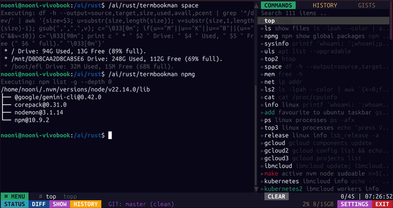

# termbookman

`termbookman` is a high-performance terminal dashboard built with Rust and the Ratatui TUI framework. It provides a specialized environment for developers, combining a live PTY terminal with an integrated command sidebar and GitHub Gist management.

Coded mostly by Google's Gemini 3




## 🚀 Features

-   **Split-Pane Environment**: A live, functional PTY shell side-by-side with a powerful command sidebar.
-   **Multi-Source Sidebar**:
    -   **COMMANDS**: A local registry of common tasks and scripts defined in `commands.txt`.
    -   **HISTORY**: Instant access to your deduped shell history (latest 500 items).
    -   **GISTS**: Browse, search, edit, and sync your GitHub Gists directly from the TUI.
-   **Advanced Gist Integration**:
    -   Identify and execute scripts with shebangs (`#!`).
    -   Detect local modifications and prompt for GitHub uploads.
    -   Built-in Gist creation and deletion tools.
-   **Terminal Excellence**:
    -   Full 256-color support.
    -   Custom-patched `vt100` parser for accurate Alternate Character Set (ACS) rendering (ideal for tools like `btop`, `htop`, and `nvtop`).
    -   Mouse support for scrolling, selecting, and clicking.
-   **Cross-Platform ARM Support**: Dedicated build scripts for ARM64 (Ubuntu ARM) deployments.

## 🛠 Technical Stack

-   **Framework**: [Ratatui](https://github.com/ratatui/ratatui) + `crossterm`.
-   **PTY Bridge**: `portable-pty`.
-   **Terminal Parser**: A locally maintained patch of `vt100` for box-drawing character integrity.
-   **Async Core**: Powered by `tokio` for efficient event loop and I/O handling.

## 📦 Installation

### Prerequisites
-   Rust (stable)
-   `aarch64-linux-gnu-gcc` (for ARM64 builds)

### Native Build
```bash
./build.sh
```

### ARM64 Build
```bash
./build.arm.sh
```

## ⚙️ Configuration

Settings are managed in `~/.config/termbookman/config.toml`. The application will automatically create a default configuration on its first run, including:
-   External editor preference (e.g., `nano`, `vim`, `code`).
-   UI color schemes for the terminal and status bars.
-   GitHub authentication (Device Flow or PAT).
-   Customizable status bar items and actions.

## ⌨️ Controls

-   **Mouse**: Click tabs, sidebar items, and modal buttons. Scroll terminal or sidebar.
-   **Ctrl-C**: Send interrupt to the active PTY process.
-   **Shift-PageUp / Shift-PageDown**: Scroll terminal history.
-   **Settings Button**: Open the configuration modal to manage GitHub tokens and editor settings.

## 📄 License
This project is licensed under the MIT License.
