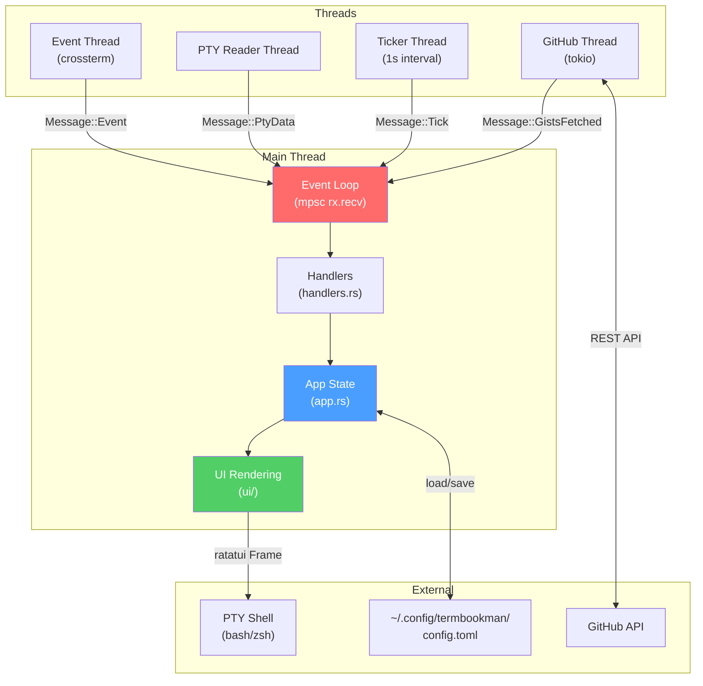
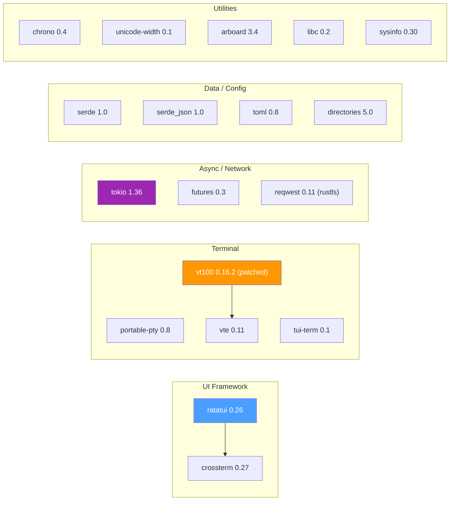
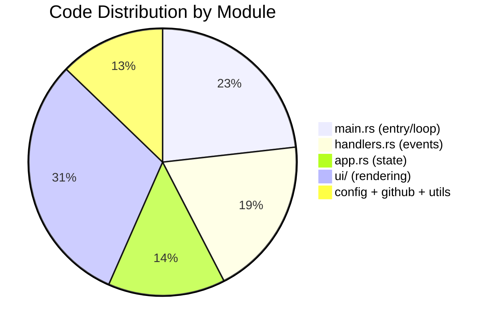

# 🔍 Project Analysis: termbookman

> A terminal dashboard combining a live PTY shell with an integrated command sidebar and GitHub Gist management, built in Rust with Ratatui.

---

## Overview

| Attribute | Value |
|---|---|
| **Language** | Rust (2021 edition) |
| **Package name** | `rust-dashboard` |
| **Binary name** | `termbookman` |
| **Total Rust LoC** | **4,754 lines** across 11 files |
| **Dependencies** | 16 crates (+ 1 patched locally) |
| **Author** | normonds (sole contributor, 18 commits) |
| **Active since** | May 6, 2026 → Aug 3, 2026 (~3 months) |
| **License** | MIT |
| **CI/CD** | GitHub Actions (Linux x86_64 + ARM64 builds) |

---

## Architecture



### Message-Driven Event Loop

The application uses a **channel-based architecture** (`std::sync::mpsc`) where all input sources (keyboard, mouse, PTY output, timers, GitHub API) send `Message` variants to a single receiver. The main thread blocks on `rx.recv()` and dispatches each message through handlers.

```rust
pub enum Message {
    Event(Event),              // Keyboard/mouse from crossterm
    PtyData,                   // PTY output ready to render
    Tick,                      // 1-second timer
    FetchGists,                // Trigger gist sync
    GistsFetched(Vec<Gist>),   // Async gist result
    GistUploadStatus(bool),    // Upload result
    DeviceAuthCode(...)        // GitHub device flow
    // ...
}
```

---

## Source File Breakdown

| File | Lines | Responsibility |
|---|---:|---|
| [`main.rs`](file:///space/termbookman/src/main.rs) | 1,103 | Entry point, event loop, PTY init, thread spawning, version check |
| [`handlers.rs`](file:///space/termbookman/src/handlers.rs) | 914 | Mouse/keyboard routing, modal interactions, PTY writes |
| [`app.rs`](file:///space/termbookman/src/app.rs) | 673 | Central `App` struct, command loading, sidebar modes, gist state |
| [`ui/modals.rs`](file:///space/termbookman/src/ui/modals.rs) | 561 | Modal dialogs (confirm, auth, upload, settings, create gist) |
| [`ui/sidebar.rs`](file:///space/termbookman/src/ui/sidebar.rs) | 449 | Sidebar rendering (Commands / History / Gists tabs) |
| [`config.rs`](file:///space/termbookman/src/config.rs) | 274 | TOML config parsing, color schemes, status bar items |
| [`ui/statusbar.rs`](file:///space/termbookman/src/ui/statusbar.rs) | 213 | Configurable status bar with clickable actions |
| [`utils.rs`](file:///space/termbookman/src/utils.rs) | 181 | Script parsing, color conversion, text formatting |
| [`ui/terminal.rs`](file:///space/termbookman/src/ui/terminal.rs) | 171 | VT100 cell → ratatui Span conversion, terminal rendering |
| [`github.rs`](file:///space/termbookman/src/github.rs) | 152 | GitHub REST API: fetch, create, update, delete gists |
| [`ui/mod.rs`](file:///space/termbookman/src/ui/mod.rs) | 63 | Layout calculation, frame rendering orchestration |
| **Total** | **4,754** | |

---

## Key Components

### 1. PTY Terminal Integration
- Uses **`portable-pty`** to spawn a real shell (inherits user's `$SHELL`)
- PTY output is parsed through a **locally patched `vt100`** crate (`patch/vt100/`)
- The patch fixes **Alternate Character Set (ACS)** rendering for tools like `btop`, `htop`, `nvtop` — proper box-drawing characters
- Parser state wrapped in `Arc<Mutex<vt100::Parser>>` for thread-safe access
- Terminal supports **256 colors**, **mouse events**, and **scroll history**

### 2. Sidebar Modes
Three switchable tab modes:

| Mode | Source | Features |
|---|---|---|
| **Commands** | `commands.txt` (config dir) | Local command registry, click-to-run |
| **History** | Shell history file | Deduped, last 500 items |
| **Gists** | GitHub API | Browse, search, edit, sync, execute scripts |

### 3. GitHub Gist Integration
- **Authentication**: GitHub Device Flow or Personal Access Token (PAT)
- **Operations**: Fetch, create, update, delete gists
- **Smart features**: Shebang detection for executable gists, local modification detection with upload prompts
- **Caching**: Gists cached locally in `~/.config/termbookman/gists/` with mtime metadata
- All network operations are **non-blocking** (tokio-spawned, results sent via channel)

### 4. Configuration System
- TOML-based config at `~/.config/termbookman/config.toml`
- Auto-generates defaults on first run
- Configurable: editor preference, color schemes, status bar items, GitHub auth, UI actions

### 5. UI Layer (Ratatui)
- **Split-pane layout**: Terminal (left) + Sidebar (right)
- **Status bar**: Configurable items with clickable actions
- **Modals**: Confirmation, settings, auth flow, upload progress, gist creation
- **Mouse support**: Click tabs, sidebar items, modal buttons; scroll terminal/sidebar
- **Text selection**: Click-and-drag with clipboard copy (`arboard`)

---

## Dependency Map



> [!NOTE]
> The `vt100` crate is patched locally via `[patch.crates-io]` in Cargo.toml. The patch lives at [`patch/vt100/`](file:///space/termbookman/patch/vt100) and modifies ACS character rendering.

---

## CI/CD

GitHub Actions workflow ([`build.yml`](file:///space/termbookman/.github/workflows/build.yml)):
- Builds for **Linux x86_64** and **ARM64**
- Creates GitHub releases with tagged artifacts
- Tag format: `v2026-MM-DD`

---

## Code Quality Observations

### ✅ Strengths
- **Clean message-driven architecture** — separates concerns well between input, state, and rendering
- **Non-blocking I/O** — all network operations are async, main thread never blocks on GitHub API
- **Well-documented** — detailed copilot instructions, README with architecture diagrams, known issues tracked
- **Patched dependency is well-managed** — local vt100 patch properly declared in Cargo.toml
- **Configuration-driven UI** — actions and appearance configurable via TOML without code changes

### ⚠️ Areas for Improvement

| Area | Observation |
|---|---|
| **`main.rs` size** | At 1,103 lines, `main.rs` is the largest file and handles event loop, PTY setup, thread spawning, and version checking. Could be decomposed into focused modules. |
| **`handlers.rs` complexity** | 914 lines of dense event routing. Consider splitting by modal/mode (e.g., `handlers/sidebar.rs`, `handlers/modal.rs`). |
| **No test coverage** | No `#[cfg(test)]` modules or integration tests found despite conventions mentioning them. |
| **Error handling** | Main uses `Box<dyn Error>` — works fine for a binary, but custom error types would improve debuggability. |
| **Thread-safety pattern** | `Arc<Mutex<>>` around the vt100 parser is correct but fragile — the copilot instructions explicitly warn about deadlocks if locks are held across I/O. |
| **Binary artifacts in repo** | `termbookman` (8.4MB) and `tbm.arm` (8.1MB) are compiled binaries checked into the repo root (though gitignored). |
| **`github.pat.txt` in helpers/** | A PAT file exists in `helpers/` — even though it's gitignored, this is a security concern if the ignore is ever missed. |
| **`sysinfo` imported but unclear usage** | The `sysinfo` crate is a dependency but its usage isn't obvious in the main code paths. |

### 🔴 Safety & Security Flags

| Issue | Details |
|---|---|
| **`unsafe` static mutable** | `app.rs` uses `static mut GIT_COUNTER: u32 = 0` inside `update_stats()` — this is UB-prone. Should be an instance field on `App`. |
| **Shell injection risk** | CLI execution interpolates user-supplied `<prompt:..>` inputs directly into `bash -c` commands without escaping. |
| **Blocking HTTP in threads** | `github.rs` uses `reqwest::blocking::Client` in spawned threads — no explicit timeout management, potential thread leaks on slow networks. |

---

## Project Maturity



The project is in **active development** with a functional, feature-rich TUI application. The codebase is relatively compact (~4.7K lines of Rust) for the features it delivers. The architecture is sound with clear separation between state management, event handling, and rendering — though some of the larger files (`main.rs`, `handlers.rs`) would benefit from decomposition as the project grows.
